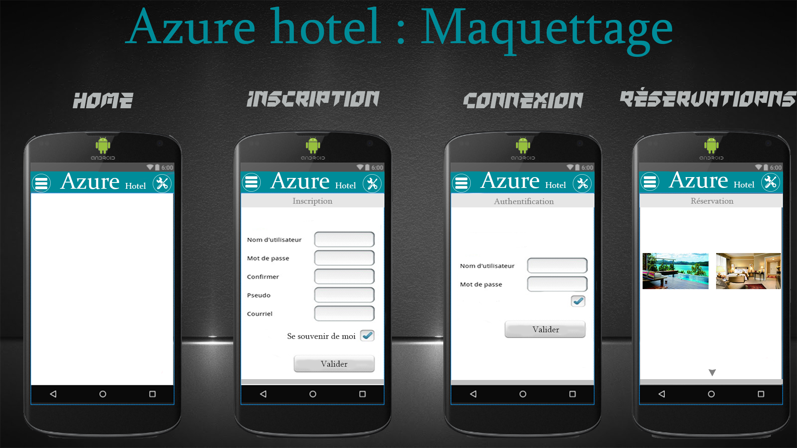

# Azur-Hotels

Nous avons pour mission de développer une application mobile Android téléchargeable ou accessible sur un plateforme web du groupe Azur.

## Introduction

- Application web (PHP, MySQL)
- Base de données MySql
- Application mobile (Web Services)

Nous utiliserons l'architecture REST qui est de plus en plus utilisé dans le web service.
L'échange de données peut se faire soit sous format XML ou JSON. Dans notre cas, il sagira du format JSON qui est très employé dans les API.

### Application web
Elle permettra de télécharger l'application mobile et servira eventuellement de serveur pour stocker les pages php nécessaire au fonctionnement de l'application mobile.
Le site sera développé en PHP.

Un repertoire `webservice` sera crée à la racine du site afin d'avoir un accès URL tel que:

      https://www.monsite.com/webservice

### Application Android

#### Maquette [Bêta]

#### Architecture

Une architecture MVC à été mise en place.
Nous avons 5 packages:
- model : Pour les models
- controller : Pour les controllers
- view : Pour les vues
- listener : Pour les interfaces
- utils : Pour les utilitaires
- webservice : Pour les requêtes Webservice en HTTP

La classe MVCPattern permet d'acceder en static aux MVC.

#### Requête envoyé par les vues
La classe `FormRequest` possede une liste public qui reference les données des formulaire. Il sagit d'un dictionnaire avec une clé et une valeur de tout type.

Une méthode `sendRequest` permet de récupérer les informations des champs et d'instancier un objet de type `FormRequest`.

#### La récuperation des données (GET)
La classe `RequestTask` permet de récuperer les données sur la plateforme web, le principe du WebService. Comme nous l'avons precisé précedement, l'échange de données se font sous format JSON.

Exemple:

    HttpGet httpGet = new HttpGet(url);
    HttpResponse httpresponse=httpclient.execute(httpGet);
    HttpEntity httpentity=httpresponse.getEntity();

    if (httpentity!=null){
        InputStream inputstream=httpentity.getContent();
        BufferedReader bufferedreader = new BufferedReader( new InputStreamReader(inputstream));
        StringBuilder strinbuilder = new StringBuilder();
        String ligne = bufferedreader.readLine();

        while (ligne!=null){
            strinbuilder.append(ligne+"n");
            ligne=bufferedreader.readLine();
        }

        bufferedreader.close();

Ici on instance HttpGet pour récuperer le flux de l'url ciblé (notre api).
Aprés avoir récuperer le flux, il faut ensuite lire le contenu et le stocker dans une variable pour pouvoir la manipuler.
Pour ce faire nous allons utiliser `InputStream` et `BufferedReader` pour la lecture et StringBuilder pour stocker une masse de caractère avec une bonne performance (lorsqu'il sagit de récupérer des informations d'une base de données parsé en JSON, il n'est pas étonnant d'avoir plus d'un millier de caractères).

    Remarque: Si on utilise String, lorsqu'il sagira de manipuler certains caratères
    sur un chaîne énorme,le framework va réallouer a nouveau le buffer et recopier le résultat tandis qu'avec StringBuilder il modifira directement la chaine initiale, on vois donc l'utilité d'utiliser le StringBuilder pour notre cas.

##### Exemple JSON
Une fois le contenu stocker dans `stringbulder`, il nous faut maintenant récuperer le format JSON.

    JSONObject jso = new JSONObject(strinbuilder.toString());
    JSONArray jsonArray = jso.getJSONArray(table);

    for (int j = 0; j < jsonArray.length(); j++) {
        JSONObject obj1 = jsonArray.getJSONObject(j);
        int id = obj1.getInt("id");
        String nom = obj1.getString("nom");
        String tel = obj1.getString("tel");
        String description = obj1.getString("description");
        double prix = obj1.getDouble("prix");

        MVCPattern.model.addHotel(id, nom, tel, description, (float) prix);
        response = RESULT.OK;

    }

On parse les informations en objet JSON graçe à `JSONObject`.
Sachant qu'on qu'une table peut contenir plusieurs occurences/lignes, nous devrons utiliser `JSONArray` pour récuperer les informations sous forme de tableau.

Maintenant il suffit de parcourir le tableau, de récuperer chaque ligne en tant qu'objet (`JSONObject obj1 = jsonArray.getJSONObject(j)`), puis on récupère les champs.

    Info : `JSONObject` comporte des méthodes permettant de récupérer
    un champ selon le type de la données (string, int, double, etc)

La ligne `MVCPattern.model.addHotel(id, nom, tel, description, (float) prix);` accède au model de l'architecture MVC, model qui appel la méthode `addHotel` permettant d'ajouter dans une liste d'hotels directement accèssible depuis l'application Android, un hotel avec les paramètres données en arguments.

#### L'envoi des données (POST)

    HttpClient httpclient = new DefaultHttpClient();
    HttpPost httppost = new HttpPost("<YOUR_SERVICE_URL>");

       try {

           JSONObject jsonobj = new JSONObject();

           jsonobj.put("name", "Aneh");
           jsonobj.put("age", "22");

           ...

##### Exemple de l'utilisation FormRequest pour effectuer un POST
Imaginons que dans le formulaire nous avions eu les champs `mail` et `pseudo`, notre HashMap devrait contenir par exemple:

    "mail" -> "mailexample@gmail.com",
    "pseudo" -> "monPseudo"

Si nous voulons envoyer ces données en JSON, on peut donc faire quelque chose similaire à ca:

    // Exemple
    for (String key : request.data.keySet()){
        jsonobj.put(key, request.data.get(key));
    }

En gros pour chaque clé dans le HashMap, on ajoute dans l'objet JSON une occurence avec la clé et la valeur correspondant a la ligne courante du HashMap

      NOTE : request est une instance de FormRequest, et data est
           le HashMap contenant les informations des champs du formulaire.

#### RequestListener
Une classe Interface à été développée pour effectuer une action bien définie à la fin d'une requete POST ou GET.

Exemple :

    RequestListener listener = new RequestListener() {
        @Override
        public void whenFinish() {
            MVCPattern.view.afficheLesHotels(MVCPattern.model.getHotels());
        }
    };

Dans cette exemple on veut afficher la liste des hotels par l'intermédiaire d'une vue lorsque la requête sera fini ( d'où le `whenFinish` ).

    Note : Il sagit de l'interface liée a la requête qui récupère la liste des hotels.

#### Constantes (RequestAction)

    public class RequestAction {

        public static final String ws_url = "http://10.0.2.2/azure_app/webservice/api.php";
        public static final String ws_url_get = ws_url + "?action=get";
        public static final String ws_url_post = ws_url + "?action=post";

        // Constants Get
        class Get{
            public static final String GET_HOTELS="get_hotels", GET_ALL_USERS="get_users";
        }

        ...

Toute les constantes en rapport avec les requêtes sont définies dans la classe `RequestAction`.

#### UrlUtils
Un utilitaire dans le package `utils` pour traiter les Urls.
Une méthode `getQueryParams` pour récuperer les paramètres d'un URL, cette méthode s'avère trés utile nottament pour tester l'action d'une requête REST Web Service.

### Base de données
Nom de la base de données : db_azur_hotels

Nous aurons besoin des tables suivantes:
- Hotels
- Reservations
- Users

## Outils utilisés

- Android studio
- Atom
- WAMP
- FakeDB ou Generator Data
- Photoshop
- Power AMC

### FakeDB

[FakeDB - Documentation et Installation](https://bitbucket.org/b4n92uid/fakedb) [ A voir ]

### Generator Data

L'outil utilisé pour remplir la base de données de facon aléatoire se nomme Generator Data.

## Membres
- SCHARTIER Isaac (Chef de projet)
- DACALOR Robin
- PIOCHE Kenjy

## Repartition des tâches

### 19 Février 2016
- SCHARTIER Isaac :
  - Mise en place de l'application mobile
  - Rédaction de la documentation
- PIOCHE Kenjy : Maquette application mobile
- DACALOR Robin : Création de la base de données - MCD

### 26 Février 2016
- SCHARTIER Isaac :
  - Développement application Android
  - Rédaction de la documentation
- PIOCHE Kenjy : Développement application Web
- DACALOR Robin : Conception des layouts et formulaires de l'application Android

### 4 Mars 2016
- SCHARTIER Isaac :
  - Développement application Android
  - Rédaction de la documentation
  - Mise en place de l'exemple de l'api PHP pour le WebService sur une architecture REST.
- PIOCHE Kenjy :
  - Développement application Web
- DACALOR Robin :
  - Intégration dans le développement de l'application Android
